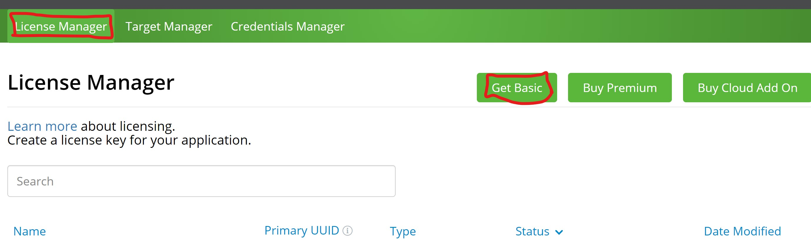
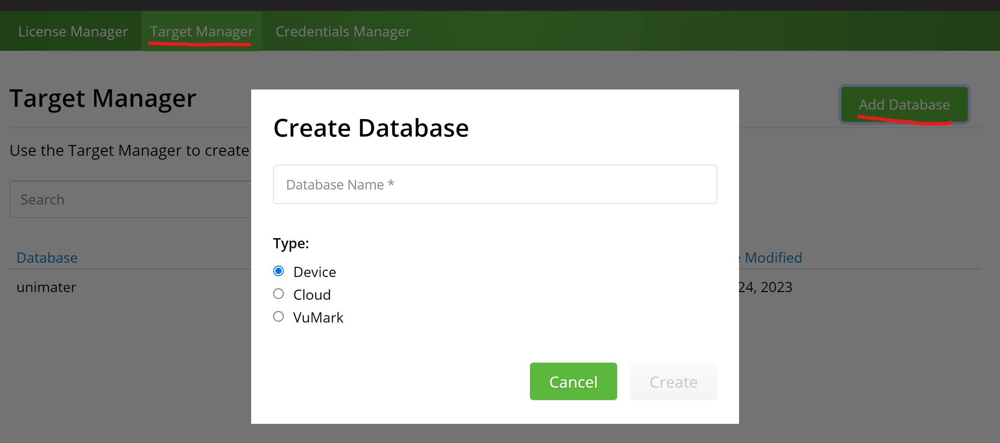
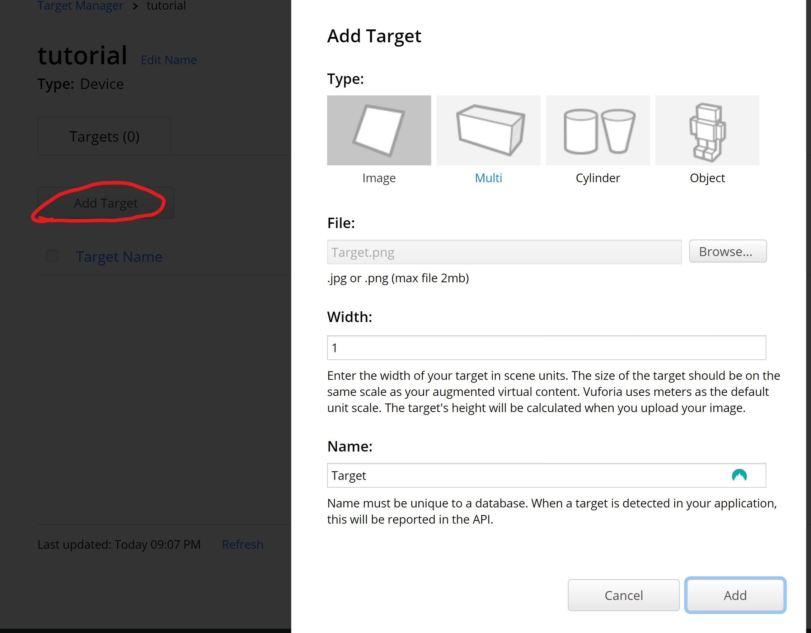
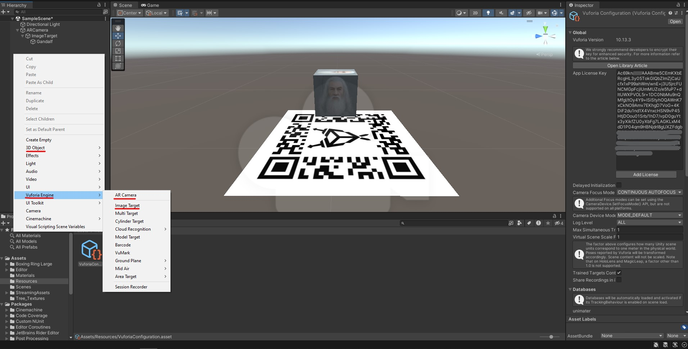
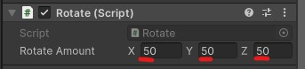

# Unity x Vuforia

Repositório dedicado a mostrar uma apliação simples utilizando Unity juntamente com o Vuforia.

**OBS: É esperado que você já possua o Unity instalado.**

## Configuração Vuforia
Primeiramente é necessário fazer a configuração do Vuforia.

 1. Download [SDK](https://developer.vuforia.com/downloads/sdk) Vuforia para Unity
	 - Ao fazer o download, basta executar o pacote baixado e importar.]
 2. Criação de conta nesse [link](https://developer.vuforia.com/vui/auth/register)
	 - Após cadastro, efetue o login.
 3. Obtenha sua chave de licença [aqui](https://developer.vuforia.com/vui/develop/licenses) e dê o nome de sua preferência.
    
 4. Adicione sua database conforme abaixo, ao finalizar abra sua database.
    
 5. Adicione o seu target usando esta [imagem](assets/Target.png "Target.png"), e adicione os parametros conforme na imagem.
    
 6. Faça o download da sua database e adicione na Unity da mesma forma que o SDK do Vuforia

## Inicio do Projeto
  Crie um novo projeto e monte sua cena adicionando o **AR Camera** e o **Target**
  

   **OBS: Não se esqueça de adicionar a chave de API do Vuforia!**

   Adicione o script abaixo a Unity, e arraste o mesmo ao cubo para que seja adicionado.

   ```c#
   using System.Collections;
   using System.Collections.Generic;
   using UnityEngine;

   public class Rotate : MonoBehaviour
   {
      public Vector3 rotateAmount;
      void Start(){}

      void Update()
      {
         transform.Rotate(rotateAmount * Time.deltaTime);
      }
   }
   ```

   Ao selecionar o cubo, nos parametros do script, adicione o Rotate Amount
   

   **Feito isto, basta dar um "play" e o seu cubo deve girar como no GIF abaixo!**

   